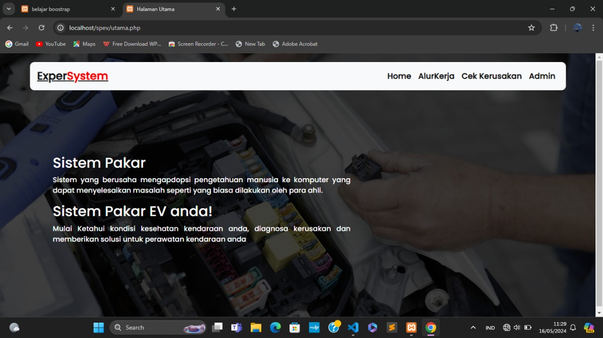
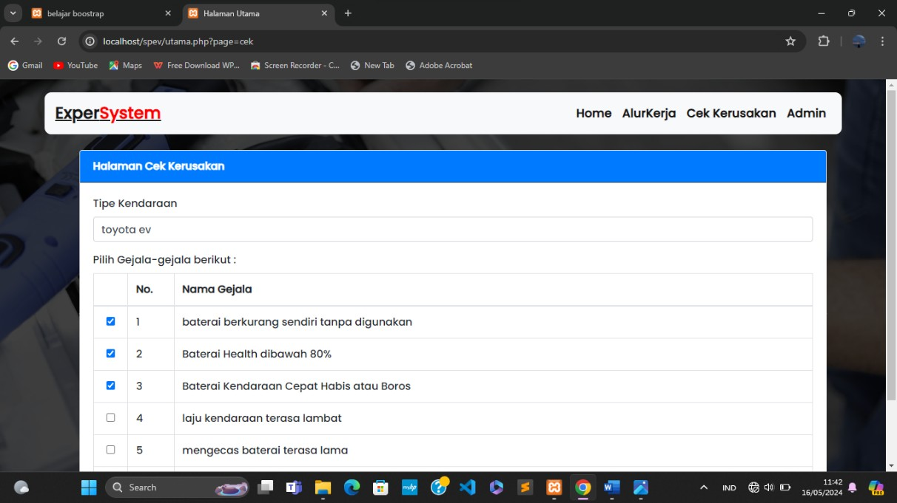
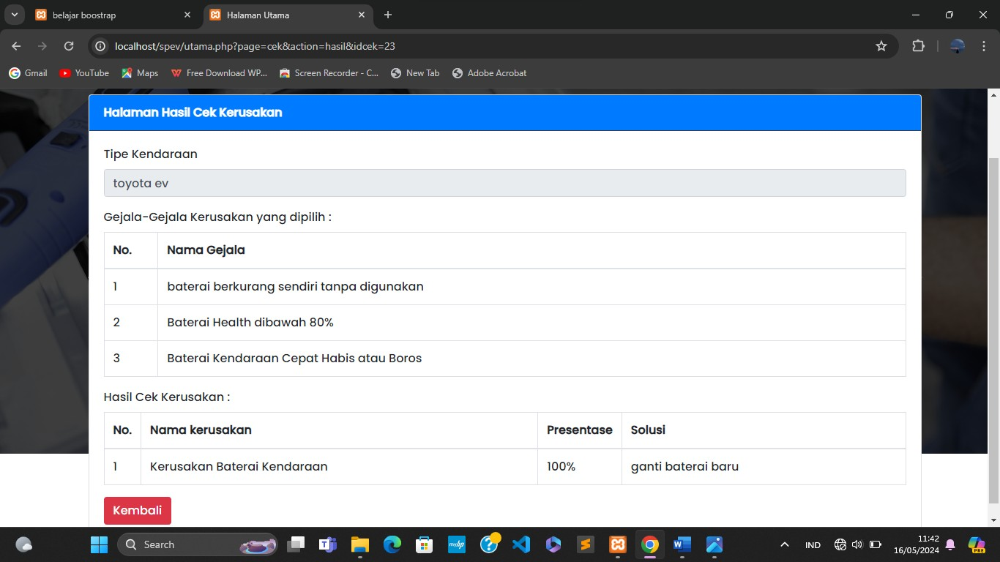
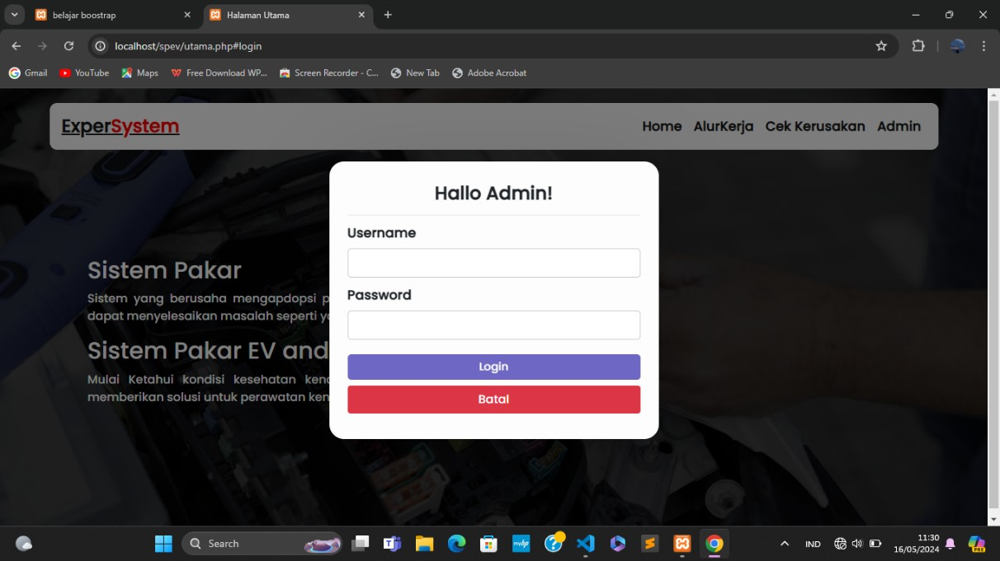
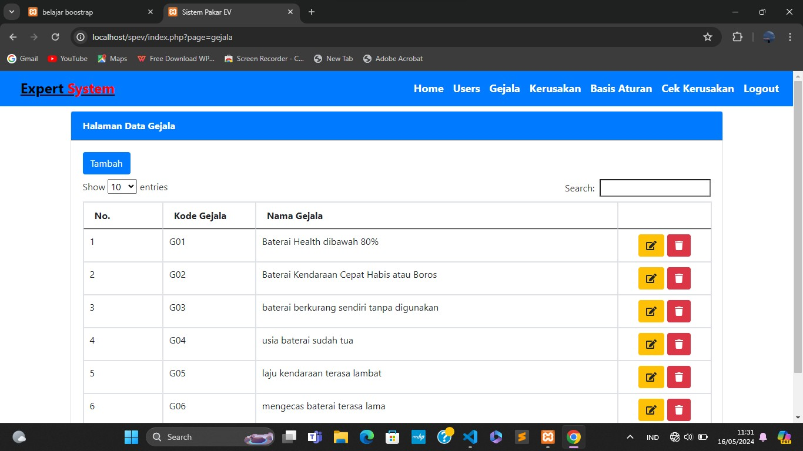
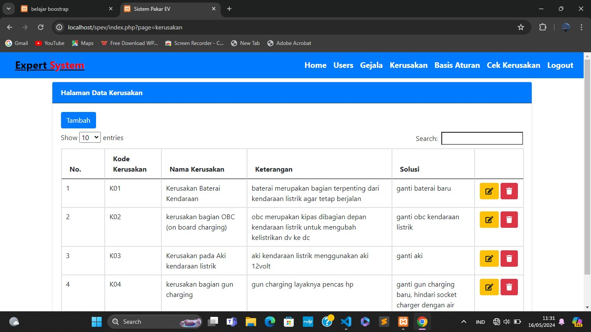
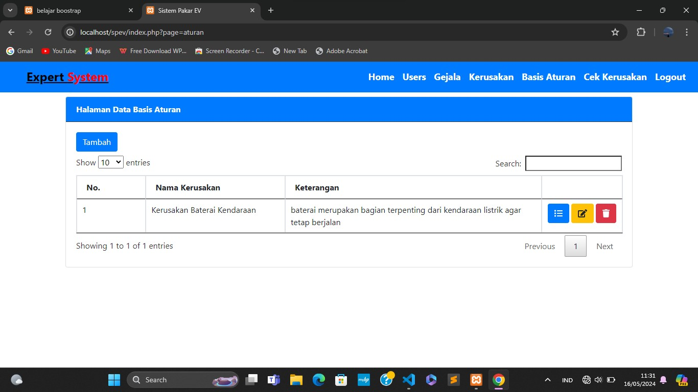
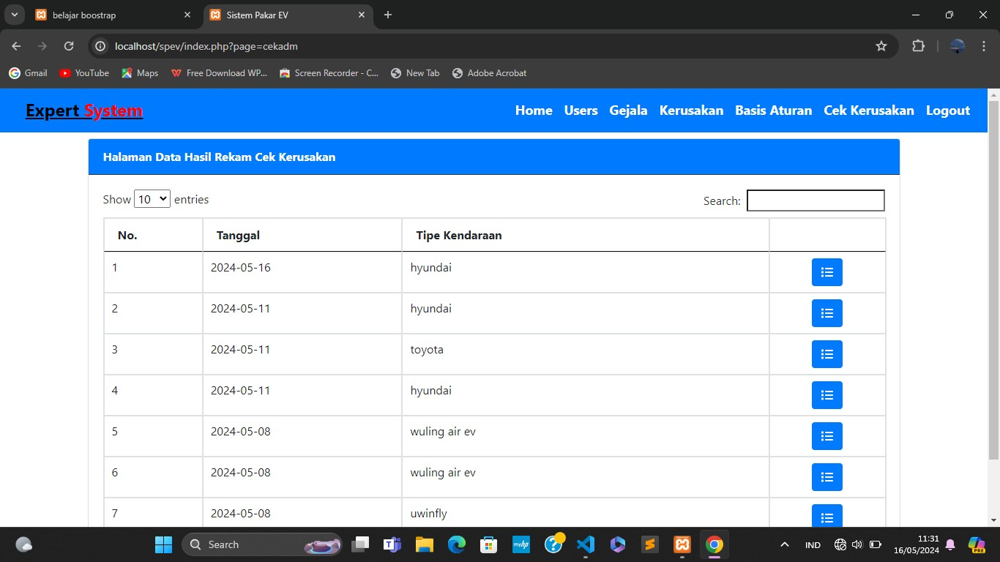

# SPEV – Sistem Pakar Electric Vehicle

**SPEV (Sistem Pakar EV)** is a PHP‑based expert system designed to assist in diagnosing and managing issues related to electric vehicles (EV). It supports rule‑based inference with user management, administration, and diagnostic workflows.

## 🧩 Table of Contents

- [Motivation & Problem Statement](#motivation--problem-statement)
- [Features](#features)
- [Tech Stack](#tech-stack)
- [Installation & Setup](#installation--setup)
- [Usage](#usage)
- [Project Structure](#project-structure)
- [Authors](#authors)
- [Acknowledgements](#acknowledgements)

## Motivation & Problem Statement

Diagnostic and decision‑making systems for EV can become complex when many possible faults, symptoms, and rules exist. SPEV aims to streamline this by providing a structured, rule‑based expert system allowing administrators to define symptoms, faults, rules, and users to execute checks and retrieve diagnoses.

## Features

- User authentication and role management (admin, user)
- Management of symptoms („gejala“), faults („kerusakan“), rules („aturan“)
- Diagnostic process: user can go through symptom checking and get a recommended fault diagnosis
- CRUD operations for entities: users, symptoms, faults, rules
- Simple web interface in PHP (and possibly JavaScript front end)
- Configurable rule engine and decision workflow

## Tech Stack

- Backend: PHP
- Frontend: HTML/CSS/JavaScript
- Database: MySQL (via `config.php` for database connection)
- CSS/Styling: custom styles in `styles` folder
- Assets: images/fonts under assets folder
- Architecture: procedural PHP + modular files (e.g., `tambah_gejala.php`, `hasil_cek.php`, etc.)

## Installation & Setup

1. Clone the repository:

   ```bash
   git clone https://github.com/Annisarh/spev.git
   cd spev
   ```

2. Configure database connection:

   - Open `config.php` and update the database host, name, username, password.
   - Create a MySQL database and run the SQL setup script (if provided).

3. Upload or place the project in your webserver root (e.g., `htdocs`, `www`, or configured vhost).

4. Ensure file permissions are correct for folders/files that require writing (e.g., logs, uploads, if any).

5. Access via browser:
   ```
   http://localhost/spev
   ```
   or your configured domain or IP.

## Usage

- **Admin** logs in and manages the data: adds/modifies symptoms, faults, and rules that link symptoms to faults.
- **User** initiates a diagnostic check: selects or indicates symptoms, the system evaluates the rules and displays the likely fault(s).
- Admin can view results, manage users, and update the knowledge base.

## Project Structure

Here is an overview of main folders/files:

```
assets/           # fonts, images, other static assets
styles/           # CSS style files
config.php        # database and configuration file
index.php         # login or main entry point
home.php          # landing page after login
utama.php         # main dashboard for admin/user
tampil_gejala.php # list of symptoms
tambah_gejala.php # add symptom
...               # other CRUD files for rules, faults, users
hasil_cek.php     # result of a diagnostic check
```

## Screenshot










## Authors

- **Annisarh** ‑ _Initial development & maintenance_ – [GitHub Profile](https://github.com/Annisarh)

## Acknowledgements

- Inspired by classic expert system models (rule‑based decision systems).
- Thanks to open‑source PHP community and supporting libraries.
